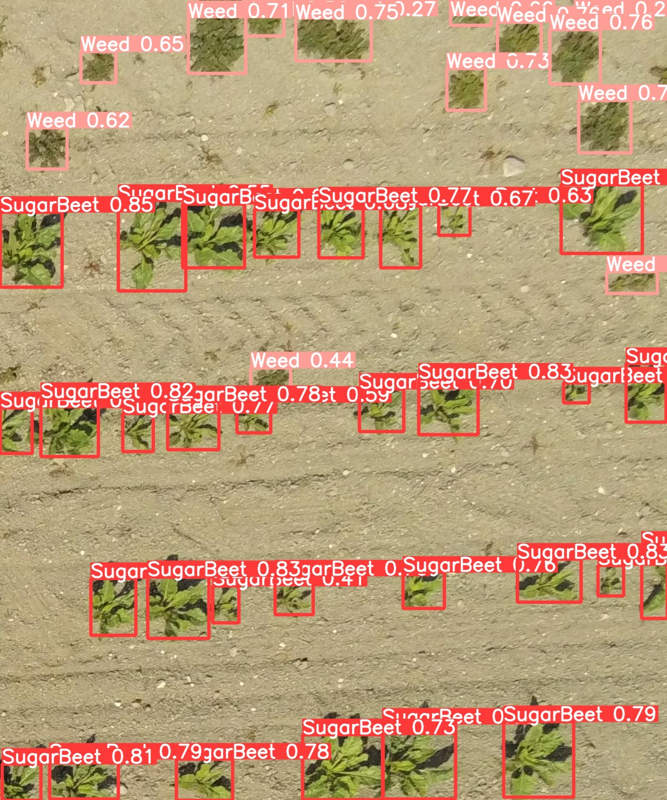

# FieldAnalyzer
Field imaging

Instructions for taking drone and robot images from fields and software for field mapping nad analysis.

## Field mapping process
1.	Using drone or robot for field monitoring
2.	Mapping the field
3.	Analyzing the field

## Using drone for field monitoring
### Purchasing drone
A light drone with high resolution RGB camera. One additional battery for 0.5 ha of field.
Examples

DJI Mini 3 Pros, ~1000 euro, battery ~80 euro

Hubsan Zino 2+, ~500 euro, battery ~20 euro
### Flight permission
For flying a light drone a registration and a theoretical test are required.

https://www.droneinfo.fi/fi/rekisteroityminen-ja-teoriakoe
### Software for flight planning
QGroundControl is a free software for planning missions for image taking.

https://docs.qgroundcontrol.com/master/en/getting_started/download_and_install.html

https://www.youtube.com/watch?v=5xswOhhqrIQ

## Mapping a field
Usually, programs creating maps by stitching together separated drone images are expensive, work long time, and distort images. All this is not required for a simple field analysis, which can be done based on separate images. A program FieldOwl is created for a simple analysis, and it is light, free and no installation is required.

The program executable file is `FieldOwl/bin/Debug/FieldOwl.exe`.

In this example a 2ha field map was created from 1100 images taken by a drone from the 4m height. Some of the images are available at https://www.kaggle.com/datasets/victorbloch/sugarbeetfield-paimio-2023-07-05-drone.

## Image analysis
Image analysis is based on an AI approach for detecting plants on images. The YOLOv5 CNN model was trained to detect different types of cultivars and distinguish them from weeds. The mapping program FieldOwl calls the detecting CNN and creates field maps with different plant features based on the detection result.
In this example, the sugar beet plants are detected. Based on the detections, the plant counting and density are valuated.

